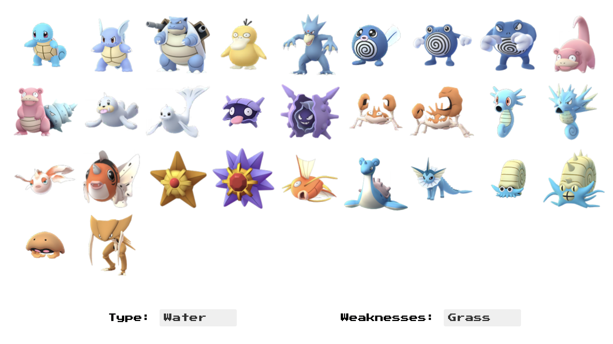

# Pokédex

Using React, this pokémon index fetches data from a public API to give our hero (you!) helpful information fit for any aspiring pokémon master. Whether a newcomer who's never heard of a pokédex or a longtime fan indulging in nostalgia, you're invited to play with this fictional device made interactive!

##

 \* *  *Technologies used include* ***React***, ***JavaScript***, ***HTML***, *and* ***CSS***. * * 

Click [here](https://pokedex-nine-red.vercel.app/) to demo.

## Site
### [Landing Page](https://pokedex-nine-red.vercel.app/)
  You're welcomed with a brief explanation of the role pokédexes play in Pokémon lore. 

### [Poster Page](https://pokedex-nine-red.vercel.app/allpokemon)
  
  Choose which pokémon to scan with your pokédex! Fans will recognize the grid-like fashion pokémon are often showcased on posters and other merchandise. Narrow your options using the type and/or weakness filters at the foot of the page.

### [Pokédex Page](https://pokedex-nine-red.vercel.app/pokemon/1)
  Find statistics on your selected pokémon. Navigate using the directional pad or find the "random" pokémon button.
  
  ** *Remaining buttons will gain functionality upon completion of a complimentary project, so stay tuned!*
## Contact Me
<!--  -->

## Acknowledgements

 - Fetched data from the Pokédex API by [biuni](https://github.com/Biuni/PokemonGO-Pokedex).
 - Logo courtesy of [bulbapedia](https://bulbapedia.bulbagarden.net/w/index.php?title=File:Pokédex_logo.png&oldid=0).